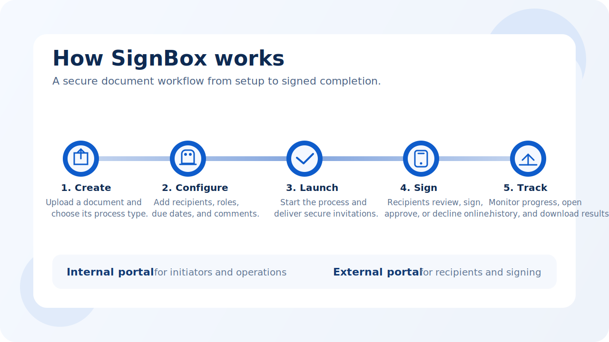

  <picture>
    <source media="(prefers-color-scheme: dark)" srcset="assets/brand/trustlynx-logo-dark.png">
    <source media="(prefers-color-scheme: light)" srcset="assets/brand/trustlynx-logo-light.png">
    
  </picture>

<h1 align="center">SignBox User Manual</h1>

  Create, send, sign, and track document workflows in one secure workspace.

  This manual is designed for real users of the current TrustLynx SignBox UI: initiators, recipients, support staff, and administrators.

  <a href="docs/initiator-quickstart.md"><strong>Start as an initiator</strong></a>
  &nbsp;&middot;&nbsp;
  <a href="docs/recipient-guide.md"><strong>View recipient flow</strong></a>
  &nbsp;&middot;&nbsp;
  <a href="docs/history.md"><strong>Open support paths</strong></a>

  

## Why SignBox

SignBox is a document workflow solution for secure electronic signing. Initiators use the internal portal to create and manage signing processes. Recipients use the external portal to review documents, authenticate, and complete signing.

It is built for workflows that need more than a file upload and a signature button. Users can assign roles, control signing order, reuse contacts and templates, monitor progress, and work with completed results from one product flow.

## Choose Your Path

| I want to... | Start here | Then continue with |
|---|---|---|
| Create my first signing process | [Initiator Quick Start](docs/initiator-quickstart.md) | [Initiator Deep Dive](docs/initiator-deep-dive.md) |
| Understand what SignBox does | [Overview](docs/overview.md) | [Terminology](docs/terminology.md) |
| Reuse contacts and templates | [Contacts and Templates](docs/contacts-and-templates.md) | [Initiator Deep Dive](docs/initiator-deep-dive.md) |
| Sign a received document | [Recipient Guide](docs/recipient-guide.md) | [FAQ](docs/faq.md) |
| Track or investigate a process | [History](docs/history.md) | [Troubleshooting](docs/troubleshooting.md) |
| Understand access and roles | [User and Access Management](docs/access-management.md) | [Glossary](docs/glossary.md) |

## Product Surfaces

<table>
  <tr>
    <td width="50%" valign="top">
       
      <strong>Internal portal</strong> 
      Used by employees and operational users to upload documents, configure signers, start processes, and manage history.
    </td>
    <td width="50%" valign="top">
       
      <strong>External portal</strong> 
      Used by recipients to open invitations, authenticate, review documents, sign, approve, or decline.
    </td>
  </tr>
</table>

## What You Can Do In SignBox

| Capability | What it means in practice |
|---|---|
| Create structured signing processes | Upload documents, choose document type, and define the intended workflow. |
| Configure recipients precisely | Add signers, viewers, approvers, recipient groups, due dates, and comments. |
| Reuse trusted setup | Use templates and contacts for recurring business scenarios. |
| Control the signing journey | Use `Sign first`, sequential groups, and recipient roles to shape process order. |
| Track operational status | Filter history, open process details, update unfinished processes, and investigate failures. |
| Support recipient completion | Give recipients a secure, guided flow for document review and signing. |

## How The Manual Is Organized

The manual is written as a user guide, not an API reference. Each document is focused on one practical goal:

1. Understand the product and its terminology.
2. Start a process quickly.
3. Learn advanced initiator behavior and edge cases.
4. Support recipients and resolve common issues.
5. Use history and access management confidently.

## Reading Experience Principles

This repository is intentionally structured for fast navigation:
- quick-start content first
- deeper explanations separated from first-use steps
- screenshots used to support actions, not decorate pages
- terminology and troubleshooting centralized instead of repeated

## Documentation Map

1. [Overview](docs/overview.md)
2. [Terminology](docs/terminology.md)
3. [Initiator Quick Start](docs/initiator-quickstart.md)
4. [Initiator Deep Dive](docs/initiator-deep-dive.md)
5. [Contacts and Templates](docs/contacts-and-templates.md)
6. [Recipient Guide](docs/recipient-guide.md)
7. [History](docs/history.md)
8. [Troubleshooting](docs/troubleshooting.md)
9. [FAQ](docs/faq.md)
10. [User and Access Management](docs/access-management.md)
11. [Glossary](docs/glossary.md)
12. [New User Simulation](docs/new-user-simulation.md)

> [!NOTE]
> The screenshots and examples in this repository are for documentation and test purposes. Product behavior and available controls can vary by tenant configuration and assigned role.
