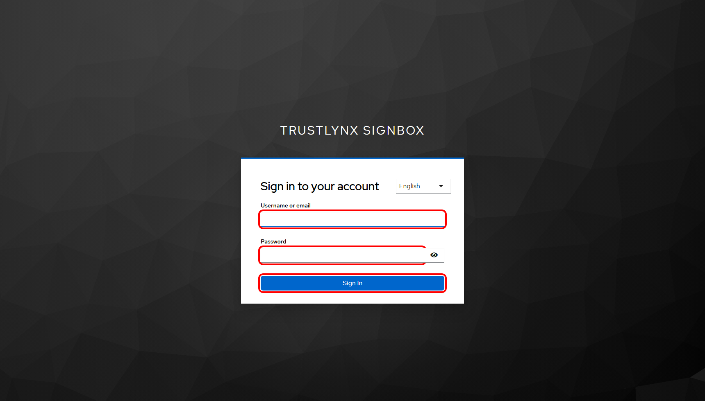
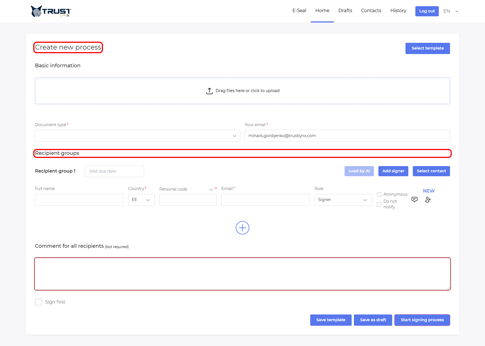
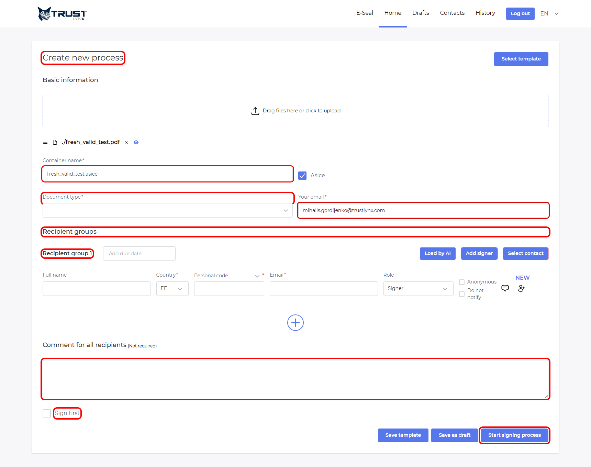
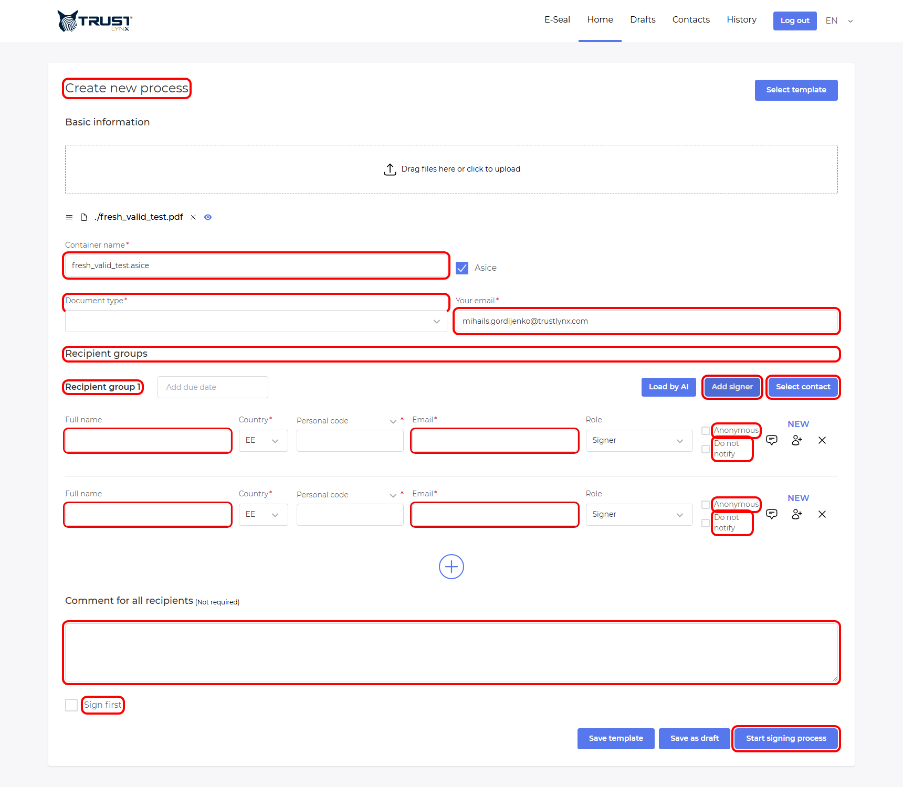
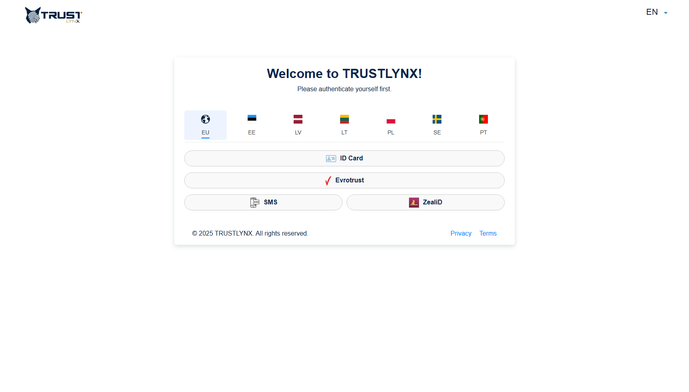
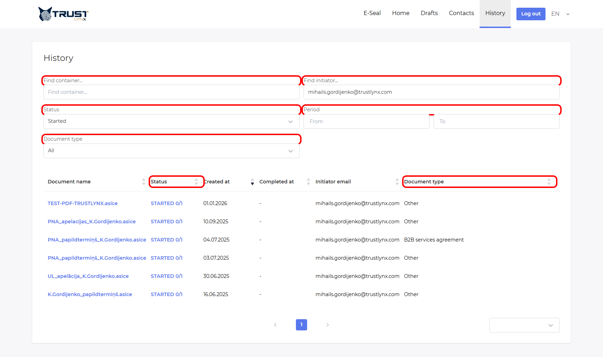
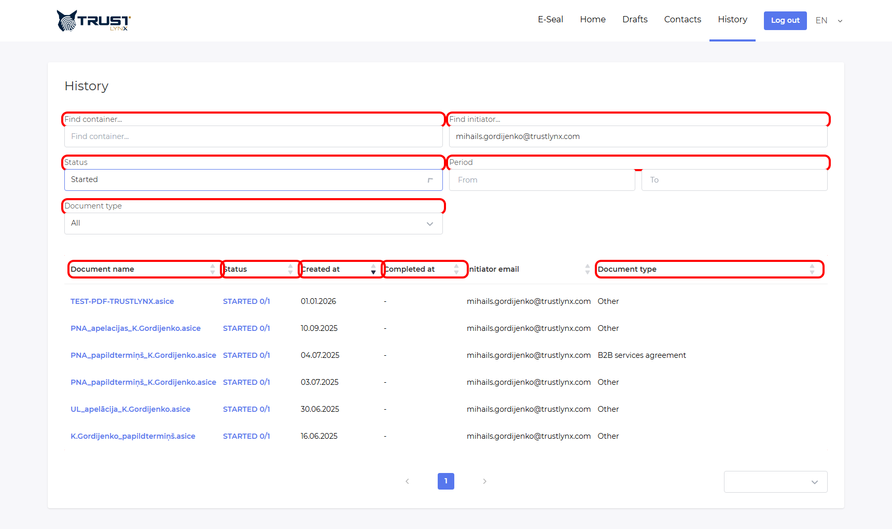
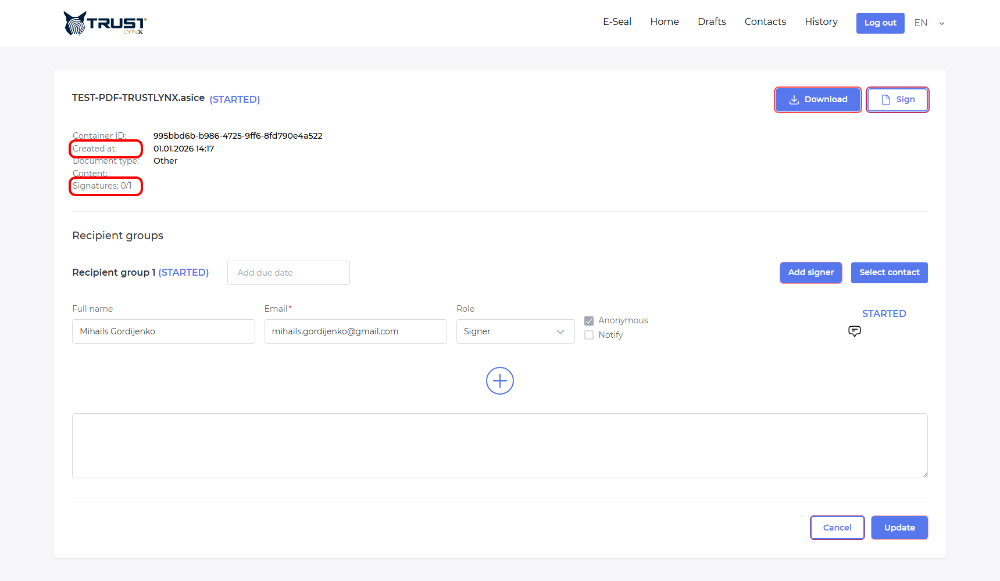

# SignBox User Manual (TrustLynx)

SignBox is a web-based platform for preparing, sending, signing, and tracking electronic document signing processes. In TrustLynx, users normally create processes in the internal portal and recipients complete signing in the external portal.

## Who This Guide Is For
1. Initiators (employees who create signing processes)
2. Recipients/Signers (people who receive and sign or decline)
3. Testers/UAT users validating process behavior
4. Business admins who need operational understanding (not deployment-level admin)

## Before You Start
1. You have internal portal access (`https://signbox.<tenant>` in examples).
2. You know whether your account is regular user or admin.
3. You have at least one test file (PDF recommended).
4. You have recipient test emails.
5. You know your organization policy for:
6. Allowed recipient roles (`Signer`, `Viewer`, `Approver`)
7. Anonymous vs non-anonymous recipients
8. Due dates and reminder expectations

> Note
> This manual is verified against current TrustLynx SignBox configuration and current internal frontend code (`signing-frontend`) plus environment config in `trustlynx-infra-tools`.

> Warning
> Some capabilities are configuration-dependent. When this is the case, the section is explicitly marked and includes a verification method.

## Table Of Contents
1. [Terminology](#terminology)
2. [Overview](#overview)
3. [Quick Start For Initiators (3-5 Minutes)](#quick-start-for-initiators-3-5-minutes)
4. [Initiating A Signing Process (Deep Dive)](#initiating-a-signing-process-deep-dive)
5. [Contacts And Templates](#contacts-and-templates)
6. [Recipient Guide: How To Sign A Received Document](#recipient-guide-how-to-sign-a-received-document)
7. [Tracking And Managing Processes (History)](#tracking-and-managing-processes-history)
8. [Troubleshooting](#troubleshooting)
9. [FAQ](#faq)
10. [User And Access Management](#user-and-access-management)
11. [Glossary](#glossary)
12. [New User Simulation (Nina) + Coverage Check](#new-user-simulation-nina--coverage-check)
13. [Coverage Report](#coverage-report)

## Terminology
Use these terms consistently:

1. Process: A signing workflow instance containing document(s), recipients, statuses, and metadata.
2. Container: Final signed package name/output (often ASiC-E; can be PDF depending on setup/options).
3. Recipient: A person included in the process.
4. Recipient group: One process step containing one or more recipients.
5. Role:
6. `Signer`: signs.
7. `Viewer`: can view.
8. `Approver`: approval-related behavior (if configured in process rules).
9. Anonymous / Non-anonymous:
10. Anonymous: no personal identifier required in recipient setup.
11. Non-anonymous: personal code or phone value required according to country/method.
12. Due date: Deadline per recipient group step.
13. Template: Reusable process setup.
14. Contacts: Saved recipient profiles for faster reuse.
15. History: Process list and filters for tracking/managing existing processes.

## Overview
TrustLynx SignBox has two user-facing portals:

1. Internal portal (`signbox.<tenant>`): create, track, and manage processes.
2. External portal (`esign.<tenant>`): recipient-facing signing experience.

Typical use cases:

1. HR contract signing
2. Internal approvals
3. Multi-party agreement signing
4. Sign-and-view workflows

Roles:

1. Initiator: creates process, sets recipients, tracks status.
2. Recipient: receives invitation, signs/declines/views.
3. Admin (if assigned): additional management menus (document profiles/attributes).

Security and privacy (practical):

1. Access is authenticated (Keycloak-based in TrustLynx setup).
2. Actions are process- and role-scoped.
3. Avoid sharing process URLs in open channels.
4. Redact personal IDs when sharing screenshots.

*Figure: Internal portal login. Red outlines show the fields/actions used in this guide.*

### Common mistakes & fixes
1. Mistake: opening external portal to create processes.
2. Fix: process creation is in internal portal.
3. Mistake: assuming all roles see management pages.
4. Fix: management is role-gated (`int-portal-admin`).

### Related sections
1. [Quick Start For Initiators (3-5 Minutes)](#quick-start-for-initiators-3-5-minutes)
2. [User And Access Management](#user-and-access-management)

## Quick Start For Initiators (3-5 Minutes)
Goal: create and launch a process quickly.

1. Open internal portal and log in.
2. On `Home`, upload your file.
3. Confirm `Container name` auto-fills; adjust if needed.
4. Select `Document type`.
5. Check `Your email` (`processInitiatorEmail`).
6. In `Recipient groups`, click `Add signer`.
7. Fill recipient fields:
8. Full name
9. Email
10. Role (`Signer` by default, or `Viewer`/`Approver` if needed)
11. Country
12. Personal code/phone if non-anonymous
13. Optional: set group due date.
14. Optional: add comment for all recipients.
15. Optional: enable `Sign first`.
16. Click `Start signing process`.

Do this -> You will see this -> If not, do this:

1. Do this: click `Start signing process`.
2. You will see this: success notification and process success modal.
3. If not: check required fields, then check error toast (common: missing mandatory fields or invalid personal data format).

*Figure: Create process page. Red outlines mark the key controls for first-time users.*

### Common mistakes & fixes
1. Mistake: forgetting recipient email.
2. Fix: email is required for notification and flow continuation.
3. Mistake: wrong anonymous setting.
4. Fix: if non-anonymous, ensure personal value is provided and valid for country/method.
5. Mistake: no records visible after creation.
6. Fix: open `History`, set `Status = Completed` for historical data; use `Started` for active/new.

### Related sections
1. [Initiating A Signing Process (Deep Dive)](#initiating-a-signing-process-deep-dive)
2. [Tracking And Managing Processes (History)](#tracking-and-managing-processes-history)

## Initiating A Signing Process (Deep Dive)

### 1) Uploading files and containers
1. Use drag-and-drop or click upload.
2. The form computes `Container name` automatically from file name.
3. `Container name` is editable and required.

Do this -> You will see this -> If not, do this:

1. Do this: upload one PDF.
2. You will see this: options like `Asice` may appear.
3. If not: confirm file type; non-PDF behavior differs.

*Figure: After document upload. Red outlines show where to set container/type/initiator and start recipient setup.*

### 2) Sign as PDF vs container behavior
Current verified behavior:

1. If one PDF is uploaded, `Asice` checkbox is shown (unless forced by config).
2. If multiple PDFs are uploaded and ASiC-only is not enforced, `Merge PDFs` can appear.
3. If multiple docs or ASiC extension is used, container defaults to ASiC-style packaging.

Configuration-dependent:

1. `VITE_ASICE_ONLY` may force ASiC behavior and hide/disable options.
2. Verify in UI by uploading one PDF and checking whether `Asice` is toggleable.

### 3) Document type
1. `Document type` is required.
2. Visible values depend on configured document profiles.
3. First type may be auto-selected (config option).

Configuration-dependent:

1. Which types appear and which attributes are required come from backend profile configuration.
2. Verify by opening the dropdown and checking available values.

### 4) Initiator email
1. `Your email` is pre-filled from logged-in profile in most setups.
2. Keep it valid; notifications and process metadata rely on it.

### 5) Recipient setup
#### Add manually
1. In `Recipient groups`, click `Add signer`.
2. Fill:
3. Full name
4. Email
5. Role
6. Country
7. Personal value (if non-anonymous)
8. Optional recipient comment
9. Optional recipient notification toggle
10. Optional signer language

#### Add from Contacts
1. Click `Select contact` in group header.
2. Filter/select contacts.
3. Confirm selection.

#### Recipient groups (parallel vs sequential)
1. Each recipient group is one process step.
2. Recipients inside the same group are processed in parallel.
3. Multiple groups are processed step-by-step (sequential progression by group order).

#### Roles (Signer/Viewer/Approver)
1. Signer: signing actor.
2. Viewer: document viewer in process.
3. Approver: approval role where workflow/policy supports it.

Configuration-dependent:

1. Allowed roles can be restricted by config (`VITE_ENABLED_ROLES`).
2. Verify by checking role dropdown values.

#### Nationality (Country)
1. Country affects validation and downstream signing method choices.
2. Country + personal value combination should match expected national identification format/rules.

#### Anonymous vs non-anonymous
1. Anonymous checked: personal identifier not required in form.
2. Anonymous unchecked: personal identifier required.
3. Use anonymous only when your process policy allows it.

*Figure: Recipient setup details. Red outlines show the fields most users ask about.*

### 6) Comments
1. Process-level comment: `Comment for all recipients`.
2. Recipient-level comment: inside signer row (comment icon).
3. Recipient-level comment can be updated later in process edit, depending on status/editability.

### 7) Due date
1. Due date is set per recipient group header.
2. It defines deadline for that step.

Configuration-dependent:

1. Reminder behavior is backend policy-driven; UI sets due date but reminder schedule may be service-configured.
2. Verify reminder policy with admin/ops.

### 8) Sign First
1. `Sign first` checkbox is available in process comment section.
2. When enabled, initiator signing is expected earlier in the flow.

Configuration-dependent:

1. Exact runtime behavior can vary by backend process policy.
2. Verify by running a test process with and without `Sign first`.

### 9) Start process
1. `Save as draft` creates draft process.
2. `Start signing process` starts active flow.
3. Success modal offers quick navigation.

Email behavior:

1. Recipients receive notifications according to process and signer notification settings.
2. In multi-group flows, later groups are typically engaged after previous step completion.

### Common mistakes & fixes
1. Mistake: trying to add personal code while anonymous is checked.
2. Fix: uncheck anonymous if personal data is required.
3. Mistake: setting wrong recipient role.
4. Fix: confirm with process owner before start; role changes later may be limited by status.
5. Mistake: expecting all groups to activate immediately.
6. Fix: groups are step-based; only current step recipients proceed.

### Related sections
1. [Contacts And Templates](#contacts-and-templates)
2. [Tracking And Managing Processes (History)](#tracking-and-managing-processes-history)

## Contacts And Templates

### Contacts
What you can do:

1. Create contact
2. Edit contact
3. Delete contact
4. Filter by name/email/personal value/scope

Scope values:

1. Personal
2. Group
3. Global

Configuration-dependent:

1. Allowed scopes may be restricted by setup (`VITE_CONTACT_ALLOWED_SCOPES`).
2. Verify by opening scope dropdown in Contacts form/filter.

### Templates
What you can do:

1. Save current process setup as template.
2. Open template list and select template for reuse.
3. Delete template.
4. Filter by name and scope.

Configuration-dependent:

1. Allowed template scopes may be restricted (`VITE_TEMPLATE_ALLOWED_SCOPES`).
2. Verify in template scope filter.

Best practices:

1. Use template names that include process purpose.
2. Keep one template per major workflow variant.
3. Review templates quarterly to remove stale versions.

### Common mistakes & fixes
1. Mistake: saving template with temporary values that should be blank.
2. Fix: review before saving (especially comments and recipients).
3. Mistake: cannot see expected scope option.
4. Fix: scope is likely disabled by configuration; confirm with admin.

### Related sections
1. [Initiating A Signing Process (Deep Dive)](#initiating-a-signing-process-deep-dive)
2. [User And Access Management](#user-and-access-management)

## Recipient Guide: How To Sign A Received Document
Recipient flow is in external portal (`esign.<tenant>`).

### 1) Open invitation safely
1. Check sender/domain.
2. Confirm expected document context.
3. Open link in modern browser.

### 2) Authentication/signing methods
Configuration-dependent:

1. Available methods depend on country and configured signing methods.
2. In TrustLynx default external config, method matrix includes countries such as `eu`, `lv`, `lt`, `ee`, `pl`, `se`, `pt`, each with specific methods enabled.

Do this -> You will see this -> If not, do this:

1. Do this: open invitation and continue to signing.
2. You will see this: signing method/country selection where applicable.
3. If not: your invitation may already enforce method/country, or flow may skip selection by config.

### 3) Sign step-by-step
1. Open process page.
2. Review document.
3. Choose method if prompted.
4. Complete identity/signature confirmation.
5. Wait for completion confirmation.

### 4) Decline flow
1. Use `Decline` action.
2. Enter decline reason (if requested).
3. Submit.
4. Initiator sees declined status/comment in process details.

### 5) Download
1. When available, recipient can download signed output from process page.
2. Download behavior may vary by role and process status.

*Figure: External portal recipient view. Red outlines show the signer-facing areas referenced in this section.*

### Common mistakes & fixes
1. Mistake: invitation link expired.
2. Fix: ask initiator to restart/update process.
3. Mistake: unsupported signing method in chosen country.
4. Fix: switch country/method if allowed, otherwise contact initiator.
4. Mistake: cannot continue after authentication.
5. Fix: refresh once, retry in clean browser session, then escalate with timestamp.

### Related sections
1. [Troubleshooting](#troubleshooting)
2. [FAQ](#faq)

## Tracking And Managing Processes (History)
History is the operational control center.

### 1) Open and filter
Available filters:

1. Container name
2. Initiator
3. Status
4. Date period (`From`, `To`)
5. Document type

Important practical tip:

1. If list looks empty or sparse, set `Status = Completed` to quickly view historical data.

*Figure: History filter panel. Red outlines show the exact filters to use when finding data.*

### 2) Statuses (verified current set)
Main process-level statuses in current internal UI enum/filter:

1. `STARTED`
2. `COMPLETED`
3. `CANCELED`
4. `DRAFT`
5. `FINISHED`
6. `ESEALED`
7. `ALL`

You may also see signer-level/status labels like `DECLINED`, `PENDING`, `WAITING_FOR_PROCESS` in details and localized UI text.

*Figure: Example with `Completed` filter. Use this first when validating historical data visibility.*

### 3) Open process details
From History table, click row to open details. Typical details include:

1. Process status and document name
2. Container ID
3. Created date
4. Document type
5. Content files with view/download options
6. Signature list with signer and signing timestamp

### 4) Manage active process
In active (not completed/canceled) process view, you can usually:

1. Edit recipients in allowed states
2. Update comments
3. Add/remove recipients/groups depending on current step/status
4. Change due date
5. Set `Notify` for recipient updates where available
6. Click `Update`
7. Cancel process (with notify checkbox)
8. Start process if currently `Draft`
9. Complete process if status is `Finished`

*Figure: Process detail screen. Red outlines show where to download, sign, update, or cancel.*

### 5) Deleting from history / deleting archive document
Configuration-dependent and version-dependent:

1. Backend service includes delete API (`DELETE /process/{id}`), but current internal UI path emphasizes `Cancel`/`Update` and does not expose a standard history-row delete action.
2. Archive document deletion behavior is not exposed as a standard end-user UI action in current verified flow.

How to confirm:

1. Open process detail and history actions in your tenant.
2. If no delete button exists, treat deletion as admin/support operation.

### Common mistakes & fixes
1. Mistake: expecting to edit completed process recipients.
2. Fix: completed/canceled/e-sealed processes are read-only for main edit actions.
3. Mistake: confusion between `Cancel` and `Delete`.
4. Fix: cancel is a workflow action; delete is not standard in current end-user UI.
5. Mistake: no data visible.
6. Fix: set filter to `Completed`, widen date range, clear text filters.

### Related sections
1. [Troubleshooting](#troubleshooting)
2. [FAQ](#faq)

## Troubleshooting

### 1) "Info disappeared while creating process"
Likely causes:

1. Session timeout
2. Browser refresh/navigation
3. Share-link data decode error

What to do:

1. Re-login.
2. Reopen `Home`.
3. Recreate from template if available.
4. Save drafts for longer forms.

### 2) No email received
What to check first:

1. Recipient email entered correctly.
2. Recipient was in active/current group.
3. Notify setting is enabled where applicable.
4. Spam/junk/quarantine.

Escalate with:

1. Process ID/container name
2. Recipient email
3. Expected send time

### 3) Cannot log in
What to check:

1. Correct portal URL.
2. Browser session/cookies.
3. Account enabled in identity provider.

### 4) Smart-ID/eID/Mobile-ID issues
Configuration-dependent by country/method.

What to check:

1. Correct country chosen.
2. Method available for that country in your tenant configuration.
3. Personal data format correctness.
4. Mobile/device readiness and network.

### 5) Process action is disabled
Likely due status constraints:

1. Completed/canceled/e-sealed processes restrict edits.
2. Existing recipients in advanced statuses may lock fields.

### Escalation path
Provide:

1. Timestamp + timezone
2. Portal URL
3. User role
4. Process ID
5. Exact action and error text
6. Screenshot (redacted)

### Common mistakes & fixes
1. Mistake: retrying same broken step without checking status/state.
2. Fix: verify status and group progression first.
3. Mistake: filing ticket without process identifier.
4. Fix: always include process ID/container name.

### Related sections
1. [Tracking And Managing Processes (History)](#tracking-and-managing-processes-history)
2. [FAQ](#faq)

## FAQ

1. I cannot find my process. What should I do?
2. Go to `History`, set `Status = Completed`, widen date range, clear text filters.

3. What is the difference between group and recipient?
4. Group is a signing step; recipients inside a group are that step participants.

5. Can I start with only one recipient and add later?
6. Usually yes while process remains editable; depends on current status/step state.

7. Why is personal code field hidden?
8. `Anonymous` is enabled; disable it to require personal code/phone.

9. Can I use templates without admin role?
10. Typically yes for available scopes; exact scope options may be restricted.

11. Why do I not see Management menu?
12. It is role-gated (admin role required).

13. Is deleting a process available to all users?
14. Not as a standard visible action in current verified internal UI; cancel is standard.

15. Can recipient comments be seen by initiator?
16. Decline/recipient comment visibility appears in process details where captured.

### Common mistakes & fixes
1. Mistake: assuming all environments have identical methods/roles.
2. Fix: check config-dependent notes and verify in your tenant.

### Related sections
1. [Initiating A Signing Process (Deep Dive)](#initiating-a-signing-process-deep-dive)
2. [Recipient Guide: How To Sign A Received Document](#recipient-guide-how-to-sign-a-received-document)

## User And Access Management
What users should ask system admin for:

1. Access enablement/reset
2. Role assignment (`user`, admin-level functions)
3. Allowed signing methods/countries
4. Contact/template scope policy
5. Notification policy/reminder behavior

What is not in normal user control:

1. Identity provider configuration
2. Method provider integration (Smart-ID/eID/Mobile-ID settings)
3. Backend signing policy
4. Global deletion/archive retention policy

Where to get help:

1. Your internal support desk with process ID and timestamp.
2. TrustLynx support escalation path (per company policy).

### Common mistakes & fixes
1. Mistake: trying to solve role/config issues only in browser.
2. Fix: involve admin for tenant-level configuration changes.

### Related sections
1. [Troubleshooting](#troubleshooting)
2. [Glossary](#glossary)

## Glossary
1. ASiC-E: Archive container format for signed content.
2. Container name: Name of final output package/document.
3. Contact scope: Visibility/ownership domain for contact entries.
4. Draft: Unstarted process state.
5. Finished: Process state used before manual completion in some flows.
6. Group due date: Deadline for a recipient group step.
7. Process ID: Unique identifier of a process.
8. Sign first: Initiator-first signing option.
9. Signer language: Preferred language for recipient communication/UI context where used.
10. Step status: Status of recipient group within a process.

## New User Simulation (Nina) + Coverage Check
Persona:

1. Name: Nina
2. Background: Office/HR/admin, non-technical
3. Goal: log in and prepare a process up to just before clicking `Start signing process`

Transcript and checks:

1. Nina: “Which portal do I open to create a process?”
2. Answer: Open internal portal (`signbox.<tenant>`). External portal is for recipients.
3. Coverage check: Covered YES - Section [Overview](#overview)

4. Nina: “I logged in and don’t see old records. Did I break something?”
5. Answer: Go to `History` and set status filter to `Completed`.
6. Coverage check: Covered YES - Section [Tracking And Managing Processes (History)](#tracking-and-managing-processes-history)

7. Nina: “What is a process vs container?”
8. Answer: Process is workflow; container is signed output package/name.
9. Coverage check: Covered YES - Section [Terminology](#terminology)

10. Nina: “What do I click first to start?”
11. Answer: On Home, upload file first.
12. Coverage check: Covered YES - Section [Quick Start For Initiators (3-5 Minutes)](#quick-start-for-initiators-3-5-minutes)

13. Nina: “Why did container name appear automatically?”
14. Answer: It is auto-generated from file name and can be edited.
15. Coverage check: Covered YES - Section [Initiating A Signing Process (Deep Dive)](#initiating-a-signing-process-deep-dive)

16. Nina: “What is document type and why is it mandatory?”
17. Answer: It maps process to configured profile/metadata rules and is required.
18. Coverage check: Covered YES - Section [Initiating A Signing Process (Deep Dive)](#initiating-a-signing-process-deep-dive)

19. Nina: “Can I skip my email field?”
20. Answer: No, initiator email is required and used in metadata/notifications.
21. Coverage check: Covered YES - Section [Initiating A Signing Process (Deep Dive)](#initiating-a-signing-process-deep-dive)

22. Nina: “What is recipient group?”
23. Answer: A group is one step. Multiple recipients in same group act in parallel; groups are sequential.
24. Coverage check: Covered YES - Section [Initiating A Signing Process (Deep Dive)](#initiating-a-signing-process-deep-dive)

25. Nina: “I added recipient but role list is small. Bug?”
26. Answer: Possibly configuration-restricted roles.
27. Coverage check: Covered YES - Section [Initiating A Signing Process (Deep Dive)](#initiating-a-signing-process-deep-dive)

28. Nina: “Why do I need country?”
29. Answer: Country affects recipient validation and available signing methods.
30. Coverage check: Covered YES - Section [Initiating A Signing Process (Deep Dive)](#initiating-a-signing-process-deep-dive)

31. Nina: “What does anonymous mean exactly?”
32. Answer: Anonymous disables personal identifier requirement in recipient setup.
33. Coverage check: Covered YES - Section [Initiating A Signing Process (Deep Dive)](#initiating-a-signing-process-deep-dive)

34. Nina: “Can I add recipients from saved list?”
35. Answer: Yes, use `Select contact` from recipient group header.
36. Coverage check: Covered YES - Section [Contacts And Templates](#contacts-and-templates)

37. Nina: “Can I save this setup for next time?”
38. Answer: Yes, use template save/select flow.
39. Coverage check: Covered YES - Section [Contacts And Templates](#contacts-and-templates)

40. Nina: “What is Sign first?”
41. Answer: It flags initiator-first signing behavior; exact flow can be policy-dependent.
42. Coverage check: Covered YES - Section [Initiating A Signing Process (Deep Dive)](#initiating-a-signing-process-deep-dive)

43. Nina: “Where do I set deadline?”
44. Answer: In each recipient group header (`Add due date`).
45. Coverage check: Covered YES - Section [Initiating A Signing Process (Deep Dive)](#initiating-a-signing-process-deep-dive)

46. Nina: “Can I send different comments to one recipient vs everyone?”
47. Answer: Yes, process-level comment and recipient-level comment are separate.
48. Coverage check: Covered YES - Section [Initiating A Signing Process (Deep Dive)](#initiating-a-signing-process-deep-dive)

49. Nina: “If recipient declines, how do I know?”
50. Answer: Status/comment is visible in process details and history status indicators.
51. Coverage check: Covered YES - Section [Recipient Guide: How To Sign A Received Document](#recipient-guide-how-to-sign-a-received-document)

52. Nina: “Can I delete wrong process from history?”
53. Answer: Standard current UI emphasizes cancel; delete may be admin/config-dependent.
54. Coverage check: Covered YES - Section [Tracking And Managing Processes (History)](#tracking-and-managing-processes-history)

55. Nina: “I’m ready. What button starts everything?”
56. Answer: `Start signing process`.
57. Coverage check: Covered YES - Section [Quick Start For Initiators (3-5 Minutes)](#quick-start-for-initiators-3-5-minutes)

58. Nina: “What if no one gets email?”
59. Answer: Check recipient email, notify setting, group/step activation, spam; then escalate with process ID.
60. Coverage check: Covered YES - Section [Troubleshooting](#troubleshooting)

## Coverage Report
1. Total questions simulated: 20
2. Covered YES: 20
3. Covered NO: 0
4. Remaining weak spots:
5. Live tenant-specific signer method screens may differ by configured providers.
6. Exact reminder timing is backend-policy-dependent.
7. Recommended improvement:
8. Add tenant screenshots and one real recipient walkthrough per country/method in your production docs portal revision.

