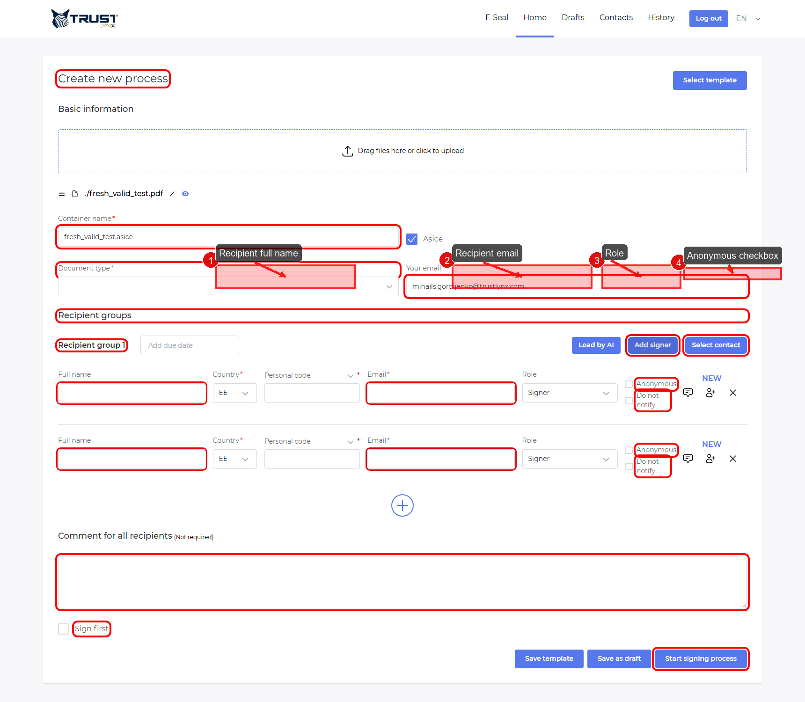

# Contacts and Templates

Use contacts and templates to speed up repetitive process creation.

## Contacts

### Step 1 - Open Contacts
- **Action**: Open `Contacts` from the top menu.
- **Expected result**: Contacts list and filters are visible.
- **If not**: Confirm your role has contacts access.
- **Screenshot**: No screenshot needed, because this repository currently has no raw Contacts-page base image and the navigation pattern is identical to other top-menu pages.

### Step 2 - Create a contact
- **Action**: Click `New`, then fill name/email/role/scope and save.
- **Expected result**: New contact appears in list.
- **If not**: Check required fields and scope availability.
- **Screenshot**: No screenshot needed, because this repository currently has no raw contact-form image in `/assets` for reliable annotation.

### Step 3 - Reuse contact in process form
- **Action**: In recipient group header, click `Select contact`.
- **Expected result**: Selected contact is added as recipient.
- **If not**: Verify contact scope and filter settings.
- **Screenshot**:

## Templates

### Step 1 - Save template
- **Action**: In process form, click `Save template` and provide template name/scope.
- **Expected result**: Template is available in template list.
- **If not**: Check scope permissions.
- **Screenshot**: No screenshot needed, because this repository currently has no raw template-modal base image for annotation.

### Step 2 - Load template
- **Action**: Click `Select template`, choose one from list.
- **Expected result**: Process form is prefilled.
- **If not**: Verify template scope and owner permissions.
- **Screenshot**: No screenshot needed, because this repository currently has no raw template-list base image for annotation.

> [!NOTE]
> Scope values (`Personal`, `Group`, `Global`) may be configuration-dependent.
