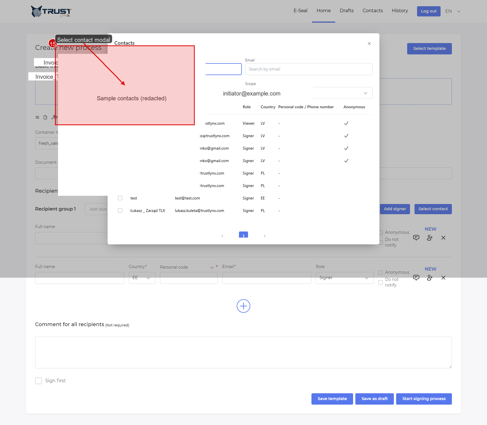
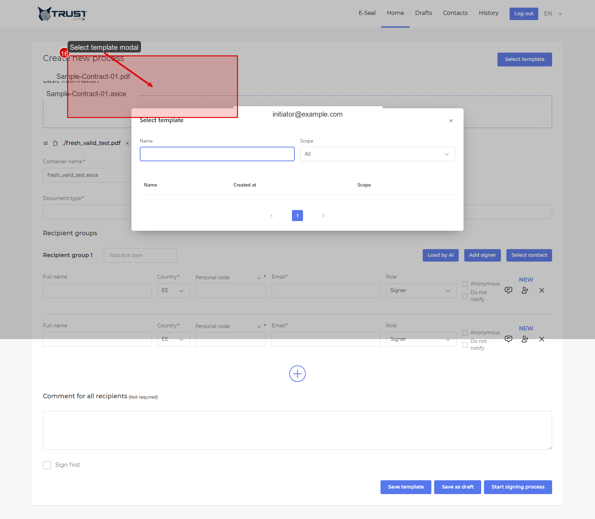

# Contacts and Templates 👥🗂️

Use contacts and templates to speed up repetitive process creation.

## Contacts

## Step 1 - Open Contacts-related action
- **Action**: In process form, click `Select contact`.
- **Expected result**: Contacts modal opens.
- **If not**: Check your role permissions for contacts.
- **Screenshot**:

  
   <em>Figure 1 — Open Select contact modal from recipient area.</em>

## Step 2 - Filter and choose contact
- **Action**: Use name/email filters and pick a contact row.
- **Expected result**: Contact is added to recipient group.
- **If not**: Verify contact scope and page filter settings.
- **Screenshot**:

  
   <em>Figure 2 — Contact filter and selection area.</em>

## Templates

## Step 3 - Open template selector
- **Action**: Click `Select template`.
- **Expected result**: Template modal opens.
- **If not**: Confirm template feature is enabled for your role.
- **Screenshot**:

  
   <em>Figure 3 — Open Select template modal.</em>

## Step 4 - Load template
- **Action**: Search/select template from list and apply.
- **Expected result**: Process form is prefilled.
- **If not**: Verify template scope (`Personal`/`Group`/`Global`) and ownership.
- **Screenshot**:

  
   <em>Figure 4 — Template filter/list area used to load template.</em>

## Step 5 - Save template
- **Action**: After preparing process fields, click `Save template`.
- **Expected result**: Template is saved for future reuse.
- **If not**: Check permission for selected scope.
- **Screenshot**:

  
   <em>Figure 5 — Save template button location in process form.</em>

> [!NOTE]
> Scope visibility is configuration-dependent.
