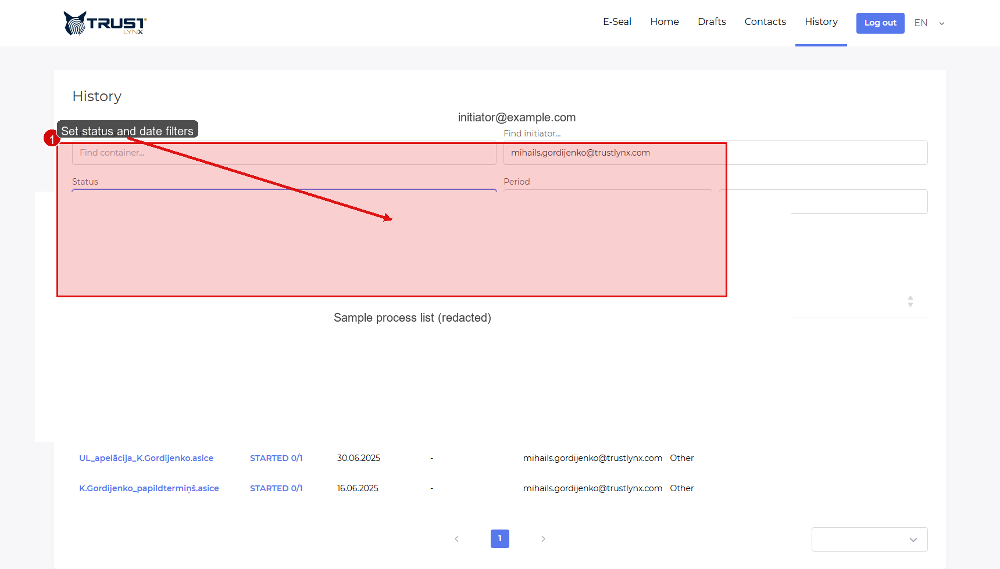
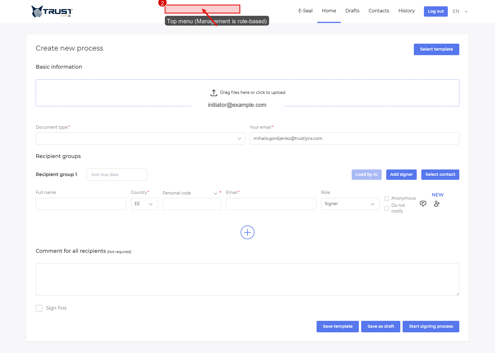
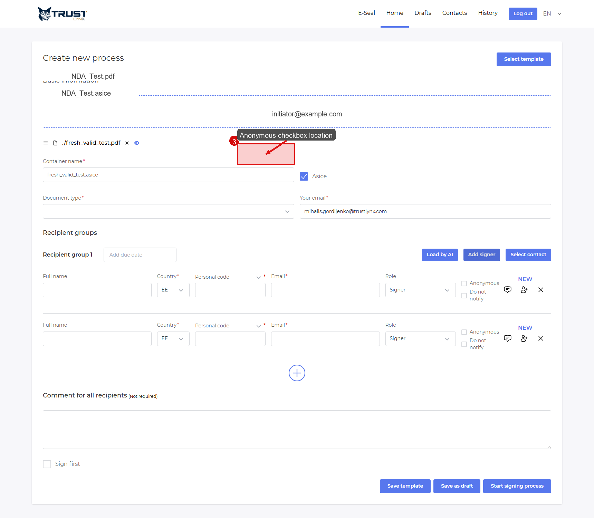

# FAQ ❓

## I cannot find my process. What should I do?
Set `History` status and date filters first.

  
   <em>Figure 1 — Use status/date filters to find your process.</em>

## Why do I not see Management menu?
Management is role-gated. If your role does not include admin permissions, the menu item is not shown.

  
   <em>Figure 2 — Top navigation area where role-based menu items appear.</em>

## What does `Anonymous` mean?
`Anonymous` means recipient matching does not rely on personal code.

  
   <em>Figure 3 — Anonymous checkbox in recipient row.</em>

### How it works internally
- Non-anonymous: `personalCode + country`.
- Anonymous: fallback by `signerId` when personal code is empty.

> [!WARNING]
> Use `Anonymous` only when policy allows identity flow without personal code.

## Can I delete a process from UI?
Typical user flow is to `Cancel` an active process. Full delete/archive behavior is configuration-dependent.

## New user simulation (Nina) 🎭

1. **Q**: Which portal do I use first?  
   **A**: `https://signbox.<tenant>` internal portal.
2. **Q**: What is first required action?  
   **A**: Upload file.
3. **Q**: Why is `Document type` mandatory?  
   **A**: It binds process rules/profile.
4. **Q**: What is recipient group?  
   **A**: One workflow step containing one or more recipients.
5. **Q**: What does `Anonymous` change?  
   **A**: Personal-code matching is skipped; fallback is `signerId`.
6. **Q**: When should I avoid `Anonymous`?  
   **A**: When legal traceability requires personal code.
7. **Q**: Where do I set due date?  
   **A**: Group header.
8. **Q**: What is `Sign first`?  
   **A**: Initiator signs before recipients.
9. **Q**: How do I find completed items?  
   **A**: `History` -> open `Status` -> choose `Completed`.
10. **Q**: What if recipient did not get email?  
    **A**: Verify email, spam, and workflow stage.
11. **Q**: Why are buttons disabled?  
    **A**: Process is likely completed/canceled/read-only.
12. **Q**: What support data should I send?  
    **A**: Process ID, timestamp, role, and screenshot.

Detailed run: [new-user-simulation.md](new-user-simulation.md)  
Coverage map: [coverage-report.md](coverage-report.md)
