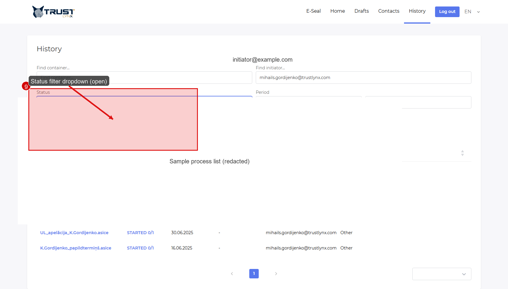

# History and Process Management

Use `History` to find existing processes, inspect progress, and manage processes that are still active.

## What History Is For

The history view is the operational center for:
- finding a process quickly
- checking its current state
- opening detailed process information
- updating unfinished processes
- canceling a process when needed
- accessing completed results

## Find a Process

History can normally be filtered by:
- container or document name
- initiator name or email
- status
- date interval
- document type

  
   <em>Figure 1 - Status filtering in the history view.</em>

Practical advice:
- if you cannot find a process, widen the date range first
- set status to the broadest reasonable option
- verify whether the process was created by another initiator

## Open Process Details

Click the process row to open its detailed view.

  
   <em>Figure 2 - Open a process from history to inspect its details.</em>

Process details typically show:
- recipients and their status
- current process state
- document metadata
- available action buttons
- download options

## Understand Process Status

Typical statuses may include:
- `Pending`
- `Started`
- `Completed`
- `Canceled`
- `Declined`
- `Draft`

Exact naming can vary by tenant, but the business meaning is usually stable:
- `Started`: active process
- `Completed`: final successful result exists
- `Canceled` or `Declined`: process ended without successful full completion
- `Draft`: prepared but not launched

## Update an Active Process

If the process is still active and editable, you can update allowed fields.

  
   <em>Figure 3 - Update action in process details.</em>

Typical allowed changes on unfinished processes:
- add a recipient
- add another recipient group
- remove a recipient who has not acted yet
- adjust comments
- change due date
- change recipient role, if allowed
- control notification behavior for updates

Important:
- availability depends on process state
- already completed signing actions are normally not editable

## Cancel an Active Process

If the process should not continue, use `Cancel`.

  
   <em>Figure 4 - Cancel an active process from the process detail view.</em>

What cancellation usually does:
- stops the process from continuing
- changes status to a canceled state
- may send notifications to involved recipients, depending on settings

Use cancel when:
- wrong recipients were added
- wrong document was used
- business decision changed before completion

## Download and Review Completed Results

From process details, completed processes normally allow you to:
- download the signed result
- inspect signature progression
- review the final completion state

This is the correct place to verify whether the process ended as expected.

## Delete and Archive-Related Actions

Some environments allow deletion of finished history items or deletion of the archived document reference. These actions are tenant- and permission-dependent.

Use deletion carefully:
- verify that the process is truly no longer needed
- understand whether deletion affects only the UI entry or also the archived document
- confirm organization retention policy before removing completed records

> [!NOTE]
> Delete behavior is usually more restricted than update or cancel behavior.

## Best Practice for Operational Review

When checking a process in history, review in this order:

1. current status
2. active or completed recipient group
3. recipient-by-recipient state
4. comments or decline reason
5. available final document

This reduces time spent guessing where the process is blocked.
