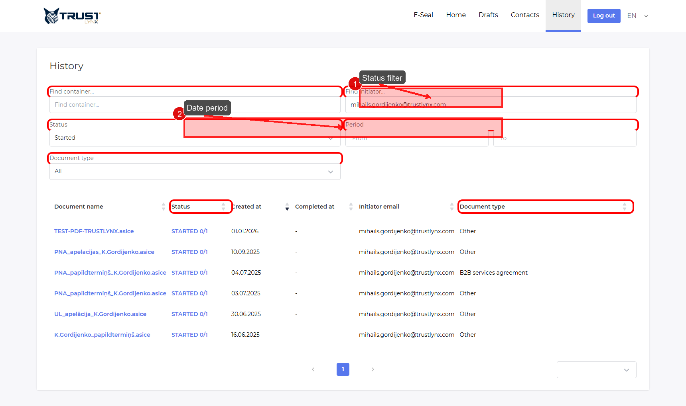
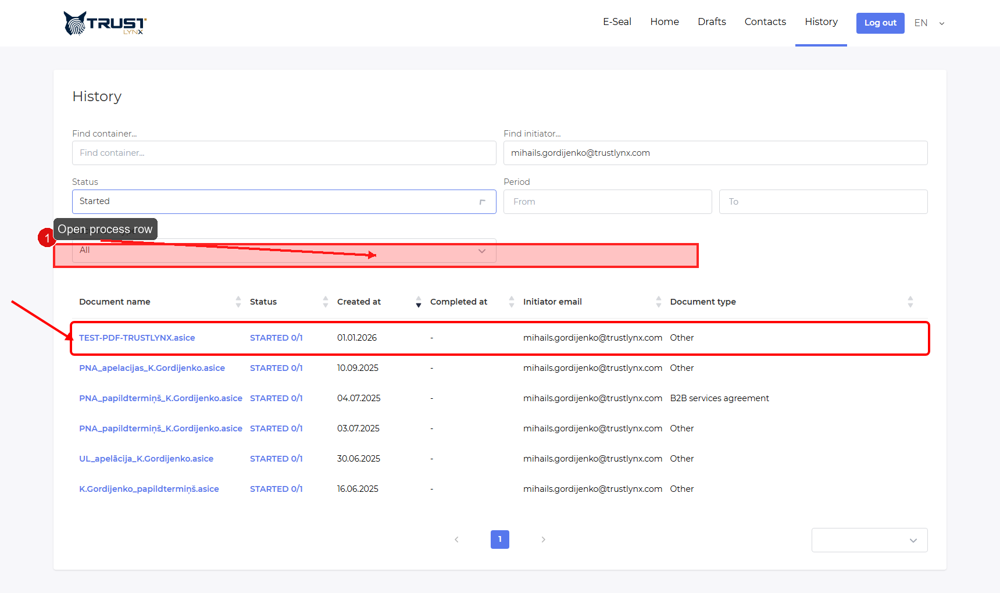
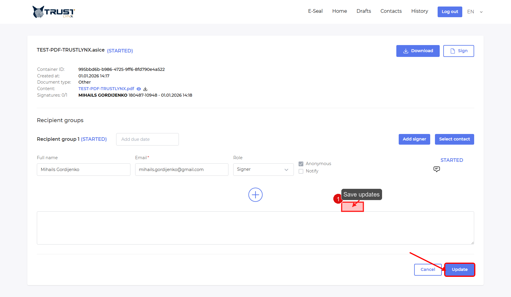
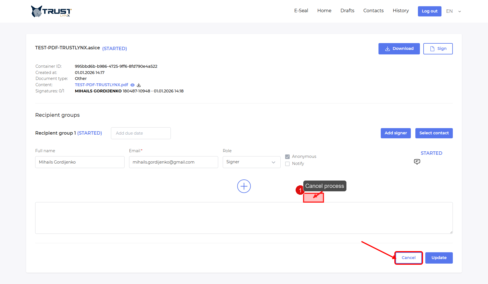

# History and Process Management

Use `History` to find, review, and manage processes.

## Step 1 - Open History and set status filter
- **Action**: Open `History` and select status.
- **Expected result**: Filter updates process list.
- **If not**: Refresh page and reapply status filter.
- **Screenshot**:

## Step 2 - Use `Completed` for historical records
- **Action**: Set status to `Completed`.
- **Expected result**: Completed processes are listed.
- **If not**: Expand date range and clear text filters.
- **Screenshot**:

## Step 3 - Open process detail
- **Action**: Click a process row.
- **Expected result**: Detail page opens with actions and signer details.
- **If not**: Verify your access scope.
- **Screenshot**:

## Step 4 - Update active process
- **Action**: Edit allowed fields and click `Update`.
- **Expected result**: Process updates successfully.
- **If not**: Check whether process is already completed/canceled.
- **Screenshot**:

## Step 5 - Cancel active process
- **Action**: Click `Cancel` and confirm notify option.
- **Expected result**: Process status changes to canceled.
- **If not**: Ensure process is still active and not read-only.
- **Screenshot**:

> [!NOTE]
> Some delete/archive operations are configuration-dependent and may not be visible in the current user UI.
