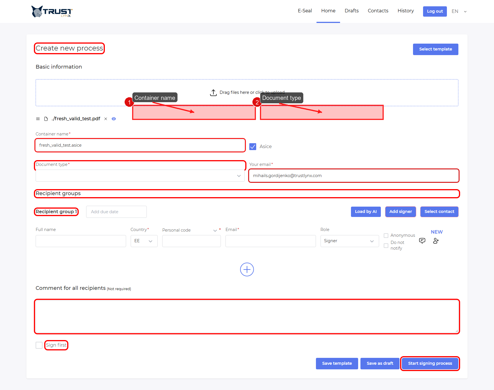
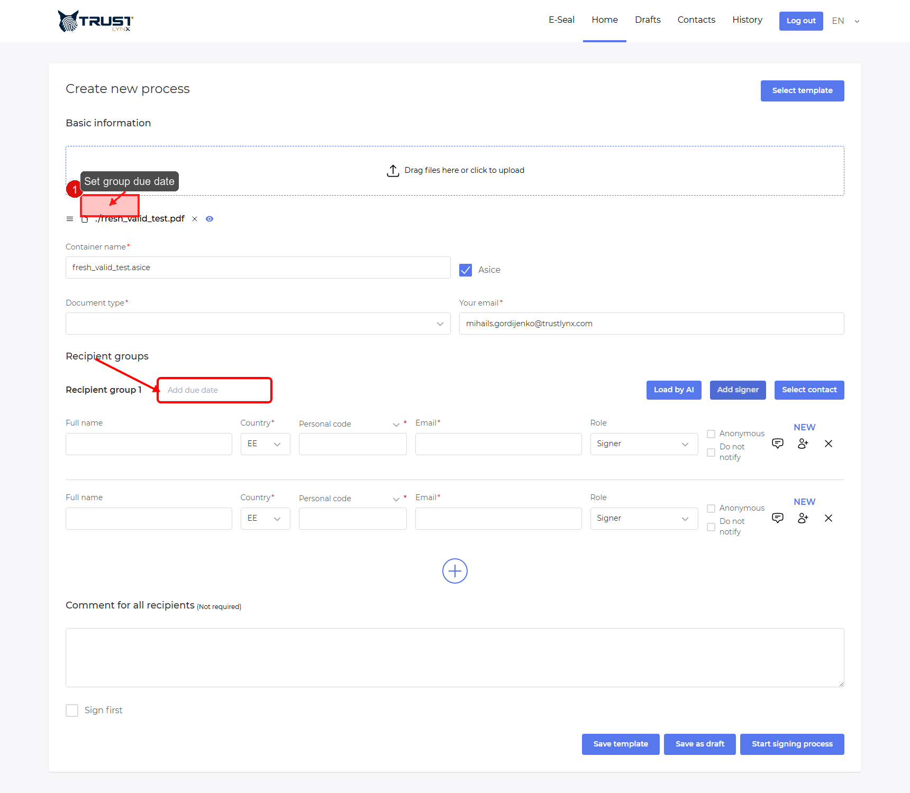
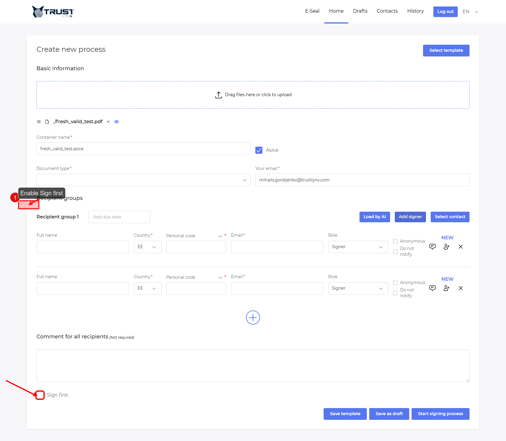
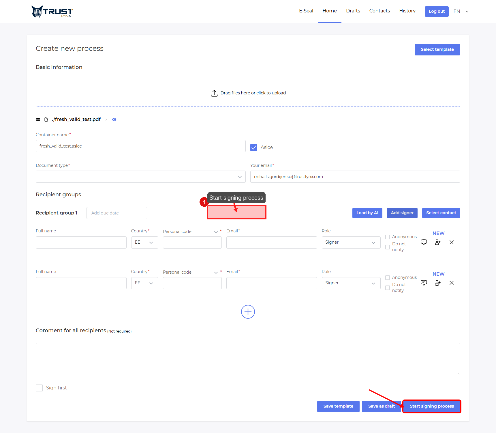

# Initiator Deep Dive

This page explains each creation field in detail.

## Step 1 - Upload and verify file area
- **Action**: Upload file in the Home process form.
- **Expected result**: File appears and form expands.
- **If not**: Try a supported file and refresh once.
- **Screenshot**:

## Step 2 - Understand container behavior
- **Action**: Review auto-generated `Container name`.
- **Expected result**: Container name is based on uploaded file.
- **If not**: Re-upload and edit container name manually.
- **Screenshot**:

## Step 3 - Choose document type
- **Action**: Open and select `Document type`.
- **Expected result**: A valid document type is selected.
- **If not**: Ask admin if profile/type is configured.
- **Screenshot**:

## Step 4 - Add recipient row
- **Action**: Click `Add signer`.
- **Expected result**: New recipient row appears.
- **If not**: Ensure process form is loaded and not read-only.
- **Screenshot**:

## Step 5 - Fill recipient fields
- **Action**: Fill recipient full name, email, role, and country/personal data where required.
- **Expected result**: Row has no validation warnings.
- **If not**: Check email format and anonymous toggle behavior.
- **Screenshot**:

## Step 6 - Configure `Anonymous` correctly
- **Action**: Toggle the `Anonymous` checkbox based on policy.
- **Expected result**: Personal code requirement changes accordingly.
- **If not**: Re-check legal/process requirements before launch.
- **Screenshot**:

### How `Anonymous` works (important)
- Frontend sends anonymous recipient with `signerPersonalCode = ''`.
- Process service marks signer anonymous when personal code is empty/null.
- Matching path:
  - Non-anonymous: `personalCode + country`
  - Anonymous: `signerId` fallback when personal code is empty

> [!WARNING]
> Use anonymous only when your process policy allows identity flow without personal code.

## Step 7 - Set due date for recipient group
- **Action**: Set due date in group header.
- **Expected result**: Due date value appears for that group.
- **If not**: Verify date picker permissions and timezone assumptions.
- **Screenshot**:

## Step 8 - Add comments and Sign first
- **Action**: Add process comment and set `Sign first` if needed.
- **Expected result**: Comment saved in form and Sign first checkbox selected.
- **If not**: Confirm no disabled state in form.
- **Screenshot**:

## Step 9 - Save draft or start process
- **Action**: Click `Save as draft` or `Start signing process`.
- **Expected result**: Draft created or process started successfully.
- **If not**: Resolve required-field errors and retry.
- **Screenshot**:

## Step 10 - Sequential groups behavior
- **Action**: Add multiple recipient groups to create multi-step flow.
- **Expected result**: Recipients in same group act in parallel; groups execute step-by-step.
- **If not**: Check process details in `History` after start.
- **Screenshot**: No screenshot needed, because behavior is temporal (workflow progression) and not represented by a single static UI block.
