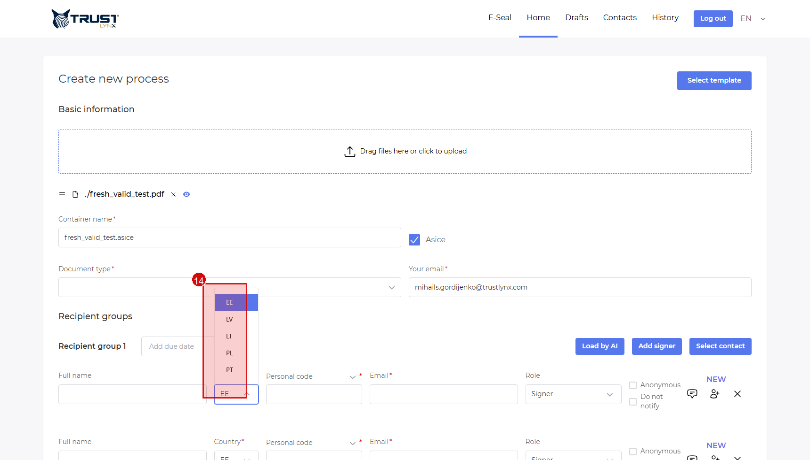
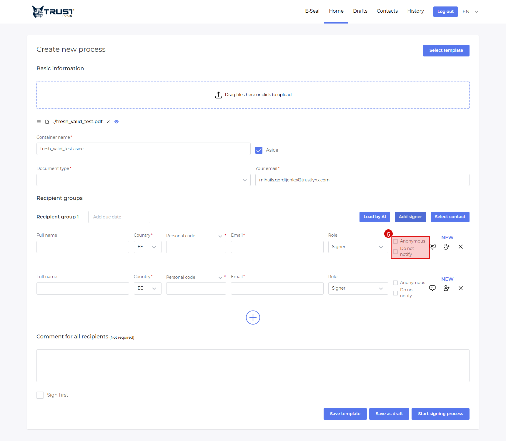
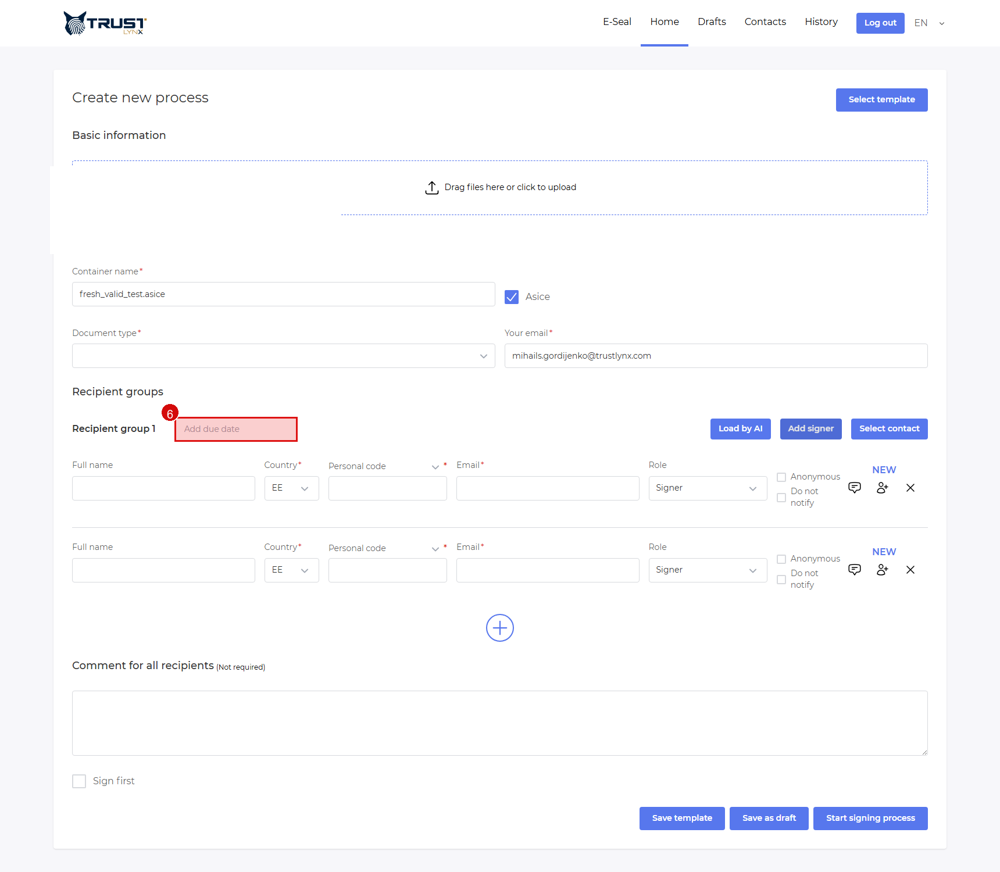
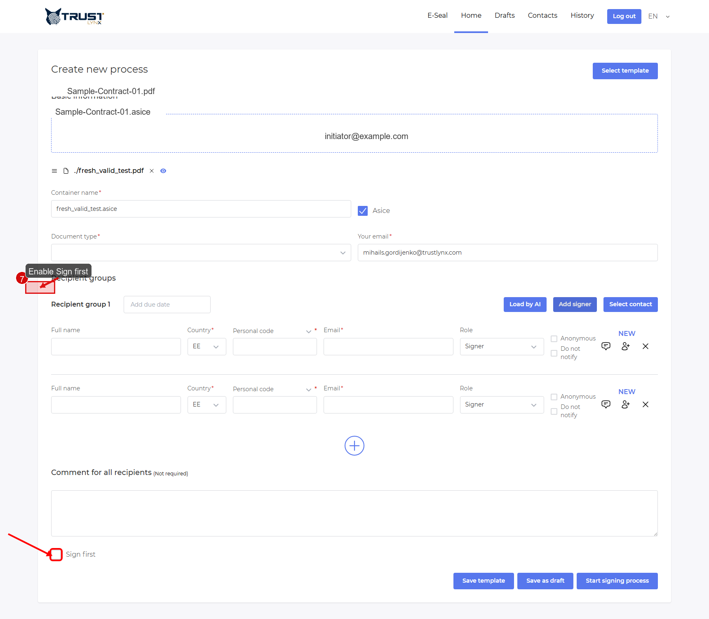

# Initiator Deep Dive 🧠

This page explains each creation field in detail.

## Step 1 - Upload area
- **Action**: Upload your file in `Home`.
- **Expected result**: File is attached and form expands.
- **If not**: Refresh once and upload again.
- **Screenshot**:

  
   <em>Figure 1 — Upload area in process form.</em>

## Step 2 - Document type dropdown
- **Action**: Open `Document type` and choose an option.
- **Expected result**: One type is selected.
- **If not**: Confirm document types are configured for your tenant.
- **Screenshot**:

  
   <em>Figure 2 — Document type dropdown in open state.</em>

## Step 3 - Recipient fields
- **Action**: Fill full name, email, and role.
- **Expected result**: Recipient row is valid.
- **If not**: Check required fields marked with `*`.
- **Screenshot**:

  
   <em>Figure 3 — Recipient fields for signer setup.</em>

## Step 4 - Country dropdown
- **Action**: Open `Country` and pick recipient country.
- **Expected result**: Country value is selected in row.
- **If not**: Verify allowed countries in this profile.
- **Screenshot**:

  
   <em>Figure 4 — Country dropdown opened with options.</em>

## Step 5 - Anonymous checkbox
- **Action**: Set `Anonymous` based on your process policy.
- **Expected result**: Personal-code logic changes for that recipient.
- **If not**: Confirm legal/compliance requirements with your admin.
- **Screenshot**:

  
   <em>Figure 5 — Anonymous checkbox location.</em>

### How `Anonymous` works
- Non-anonymous matching: `personalCode + country`.
- Anonymous matching: fallback by `signerId` when personal code is empty.

### `Anonymous` flow impact (code-verified)
- UI behavior: when `Anonymous` is enabled for a signer row, personal identity fields are hidden for that row.
- Payload behavior: the client sends empty `signerPersonalCode` for anonymous recipients.
- Backend behavior: signer is treated as anonymous when `signerPersonalCode` is empty.
- External portal authorization:
  - Non-anonymous recipient: must match both `personalCode + country` for that recipient record.
  - Anonymous recipient: recipient matching is done by invitation `signerId` (the recipient-specific link identity), not by personal code.

### Who can and cannot open the external portal task
- Can open:
  - Recipient with valid invitation link containing correct `signerId`.
  - For non-anonymous recipient, identity must also match `personalCode + country`.
- Cannot open:
  - User with wrong `signerId` (or no invitation link).
  - Non-anonymous recipient with mismatching `personalCode` or `country`.
  - Any recipient when process/step status no longer allows signing (for example canceled/expired flow conditions).

> [!WARNING]
> Use `Anonymous` only if your organization policy allows identity flow without personal code.

## Step 6 - Group due date
- **Action**: Set due date in group header.
- **Expected result**: Group due date appears next to recipient group title.
- **If not**: Check date permissions/timezone.
- **Screenshot**:

  
   <em>Figure 6 — Group due date control.</em>

## Step 7 - Sign first
- **Action**: Enable `Sign first` if initiator must sign before recipients.
- **Expected result**: Checkbox is enabled.
- **If not**: Check whether this option is allowed in current configuration.
- **Screenshot**:

  
   <em>Figure 7 — Sign first option.</em>

## Step 8 - Start process
- **Action**: Click `Start signing process`.
- **Expected result**: Process starts and invitations are sent per workflow.
- **If not**: Resolve validation errors first.
- **Screenshot**:

  
   <em>Figure 8 — Start process action.</em>

## Step 9 - Sequential group behavior
- **Action**: Use multiple recipient groups for sequential workflow.
- **Expected result**: Group 2 starts only when Group 1 is done.
- **If not**: Check recipient grouping in process details.
- **Screenshot**: No screenshot needed, because this is runtime workflow behavior rather than one static control.
