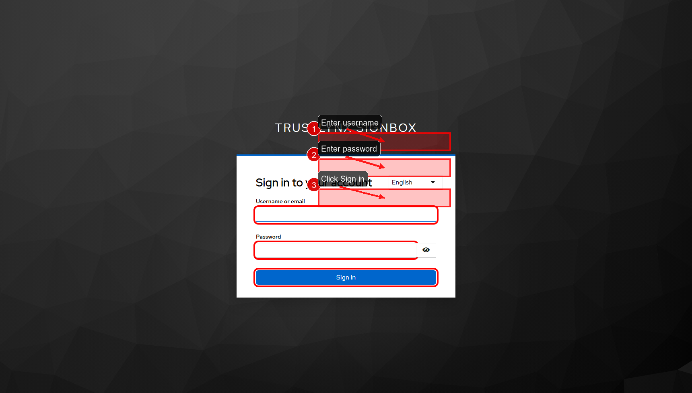
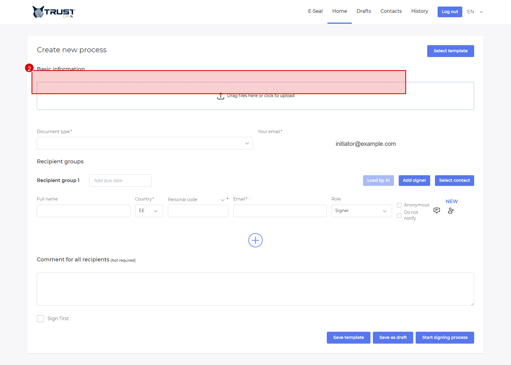
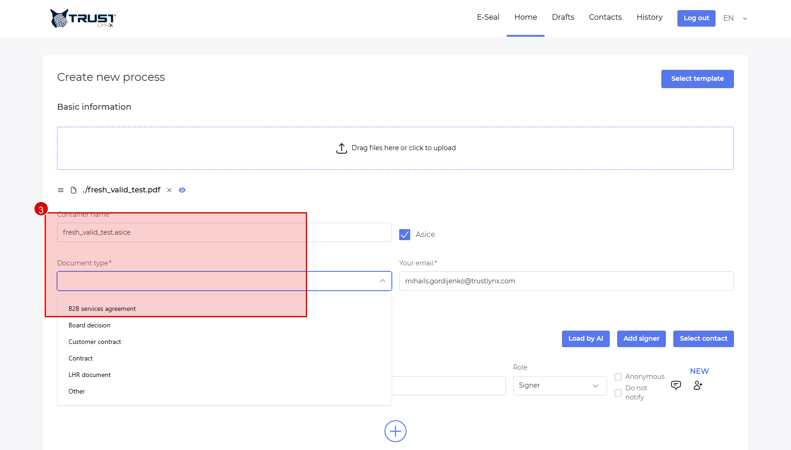
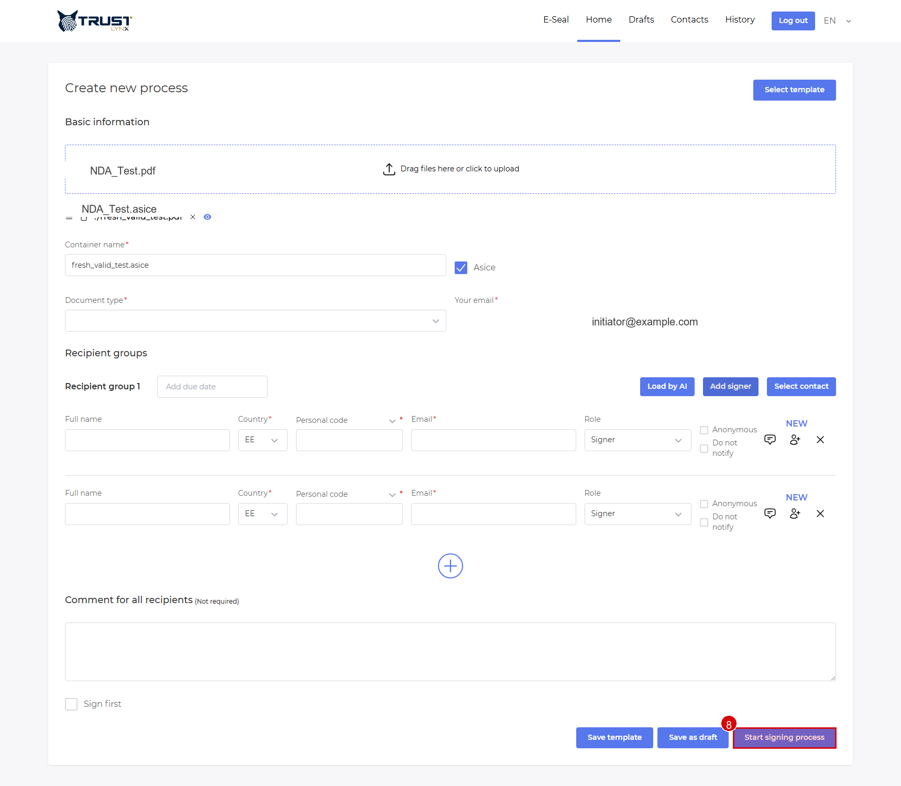

# Initiator Quick Start

Goal: create a signing process in 3-5 minutes.

## Step 1 - Log in

- **Action**: Open `https://signbox.<tenant>` and sign in.
- **Expected result**: You reach `Home`.
- **If not**: Verify account and portal URL.

  
   <em>Figure 1 - Enter login credentials.</em>

## Step 2 - Upload document

- **Action**: Drag and drop a file or click the upload area.
- **Expected result**: The file appears in the process form.
- **If not**: Retry with a supported PDF or ASiC-compatible file.

  
   <em>Figure 2 - Upload the file in the Home process form.</em>

## Step 3 - Set document type

- **Action**: Open `Document type` and select one option.
- **Expected result**: The process is mapped to the correct business profile.
- **If not**: Ask your administrator to confirm which document type should be used.

  
   <em>Figure 3 - Document type dropdown opened with visible options.</em>

## Step 4 - Fill recipient basics

- **Action**: Add signer and fill name, email, role, and anonymous setting.
- **Expected result**: The recipient row has no validation errors.
- **If not**: Re-check required fields and email format.

  
   <em>Figure 4 - Complete recipient name and email fields.</em>

## Step 5 - Optional due date and signing order

- **Action**: If the process needs a deadline, set a group due date. If the process needs staged signing, use separate recipient groups.
- **Expected result**: Deadline and signing order match the intended workflow.
- **If not**: Continue with a single group for the simplest process.

## Step 6 - Start process

- **Action**: Click `Start signing process`.
- **Expected result**: The process is created and invitations are prepared for the active workflow step.
- **If not**: Resolve required-field warnings first.

  
   <em>Figure 5 - Start signing process action.</em>

## What to read next

If this is your first process, continue with [Initiator Deep Dive](initiator-deep-dive.md) to understand:
- recipient roles
- anonymous mode
- recipient groups
- due dates
- comments
- `Sign first`
