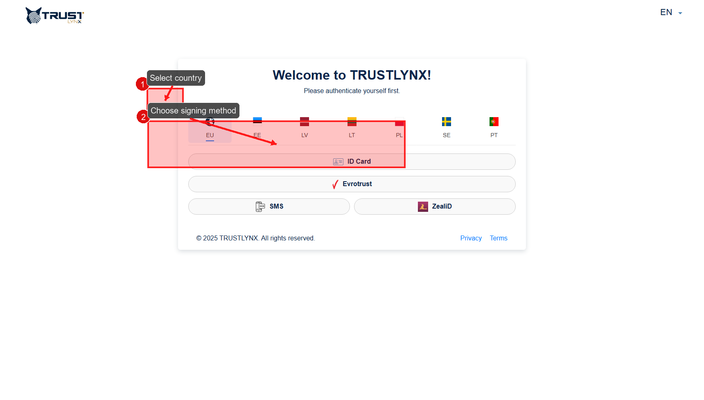
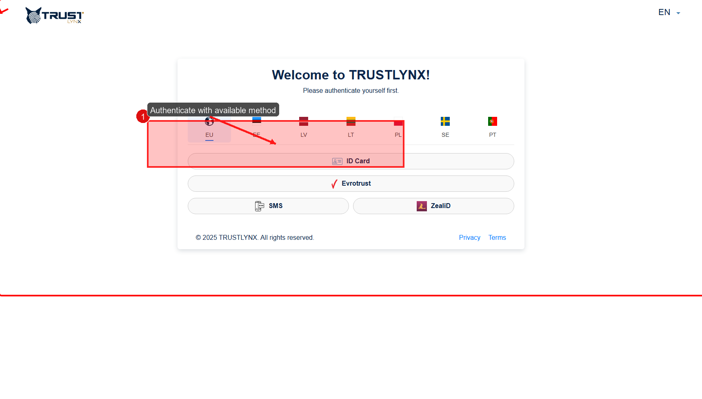

# Recipient Guide

This section is for people who received a signing invitation.

## Step 1 - Open invitation safely
- **Action**: Open invitation from your email and verify sender/domain.
- **Expected result**: External portal page opens for your process.
- **If not**: Ask initiator for a new invitation link.
- **Screenshot**: No screenshot needed, because this step starts in email client and user inbox UI is outside SignBox.

## Step 2 - Review recipient process page
- **Action**: On external portal, review the authentication card and available country tabs.
- **Expected result**: You see countries and signing methods available for your invitation.
- **If not**: Refresh once, then re-open the same invitation link.
- **Screenshot**:

## Step 3 - Select signing method (if prompted)
- **Action**: Select your country first, then click one available method (for example `Smart-ID`, `eParaksts`, or another shown option).
- **Expected result**: Authentication flow starts and you are redirected to the signing step.
- **If not**: Check whether your country/method is enabled in this tenant.
- **Screenshot**:

## Step 4 - Sign or decline
- **Action**: Complete the authentication/signing prompt in your selected provider app/device.
- **Expected result**: External portal confirms the action and updates process status.
- **If not**: Check your provider app request, then retry from invitation link once.
- **Screenshot**: No screenshot needed, because provider confirmation prompts are external to SignBox and depend on the chosen authentication service.

## Step 5 - Download signed file
- **Action**: Use download option after successful signing.
- **Expected result**: Signed file downloads.
- **If not**: Ask initiator to verify process completion in History.
- **Screenshot**: No screenshot needed, because the final download button view is configuration-dependent and not present in current capture set.

> [!WARNING]
> Do not share recipient invitation links. They can provide direct access to recipient flow.
