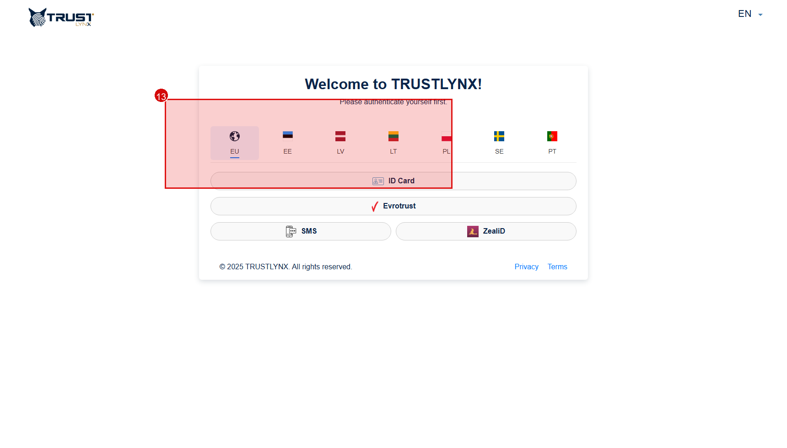
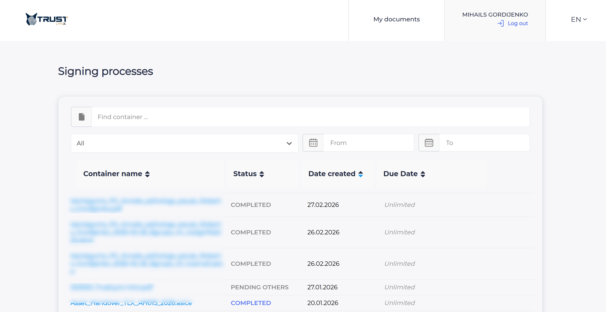
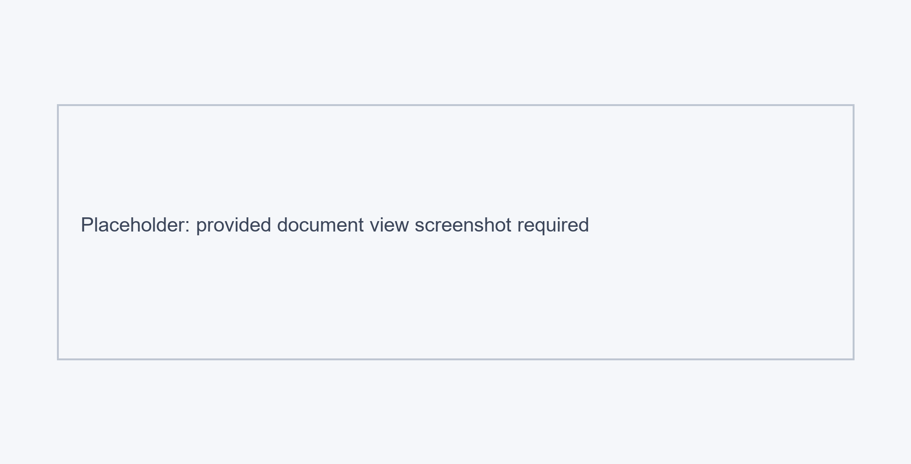

# Recipient Guide

This section is for people who receive a SignBox invitation and need to review, sign, approve, or decline a document.

## The Recipient Flow

The recipient experience normally follows this order:

1. Receive an email invitation
2. Open the SignBox link
3. Select country and signing method
4. Authenticate
5. Review the document
6. Sign, approve, or decline
7. Download the result when available

## Step 1 - Open the Invitation

Open the invitation email and use the provided SignBox link.

What the invitation usually tells you:
- who requested the signing
- what action is expected from you
- when the action should be completed

Practical note:
- the exact email branding may differ by tenant
- do not forward the invitation link to other people

## Step 2 - Authenticate in the External Portal

After opening the invitation link, SignBox redirects you to the external portal where available authentication methods depend on your country and tenant configuration.

  
   <em>Figure 1 - Select your country and available authentication method.</em>

Typical methods may include:
- Smart-ID
- ID card
- SMS or other configured methods

If you do not see the expected method:
- check whether your country was set correctly for your recipient row
- confirm that the method is supported in your tenant

## Step 3 - Confirm Identity in the Provider

After choosing a method, confirm the request in the identity provider app or device.

Expected result:
- you are authenticated into the external portal
- your assigned document becomes available for review

If this fails:
- retry once
- check device connectivity
- verify that the signing method is valid and active

## Step 4 - Open Your Task

Recipients may see the task directly after authentication or through the `My documents` area in the external portal.

  
   <em>Figure 2 - `My documents` view used to locate assigned tasks.</em>

Use filters if needed:
- container or document search
- status
- date range

## Step 5 - Review the Document

Open the process row to see document details and available actions.

  
   <em>Figure 3 - Document detail view with recipient actions.</em>

Before signing, you should review:
- document content
- comments or instructions
- current signatures, if any
- due date, if shown

You can usually:
- preview the original file
- download the file for local inspection

Best practice:
- verify the document content before signing
- do not rely only on file name or sender name

## Step 6 - Sign the Document

Click `Sign` when you are ready.

What happens:
- SignBox starts the final signing step
- the action is confirmed through your selected identity/signing method
- after success, your signature appears in the process status

Result:
- the process moves forward to the next signer or next recipient group
- when all required actions are completed, the final result becomes available

## Step 7 - Approve or Decline

Depending on your assigned role, you may be asked to approve instead of sign.

If you need to reject the process, use `Decline`.

What `Decline` does:
- stops your participation in the intended positive flow
- usually asks for a comment
- informs the initiator that the document was declined

Use a comment when declining if the initiator needs a clear reason.

## Step 8 - Download the Result

After signing is finished, the signed document or completed result can usually be downloaded from the process view.

This is useful when:
- you need a local copy
- you want to verify the visible signature result
- your organization expects you to archive the result locally as well

## Anonymous Recipients

`Anonymous` does not make the process public.

It means:
- personal-code matching is not used to validate the recipient
- access still requires the correct invitation link
- the process is still limited to the intended recipient flow

> [!WARNING]
> Do not share invitation links. A valid link is still a protected access path.

## Common Recipient Problems

### I did not receive the invitation

Check:
- spam or junk folder
- whether the initiator used the correct email address
- whether your recipient group is currently active in a sequential process

### I cannot authenticate

Check:
- selected country
- enabled authentication method
- provider availability
- validity of your signing method

### I can open the portal but not the document

Possible reasons:
- wrong invitation link
- process was canceled or completed already
- identity does not match the intended recipient in a non-anonymous flow

### Smart-ID or eID does not work

This is usually a signing-method readiness issue rather than a SignBox UI issue.

Check:
- whether your Smart-ID account is qualified for signing
- whether your ID card works correctly in browser-based signing
- whether your device and middleware are ready
